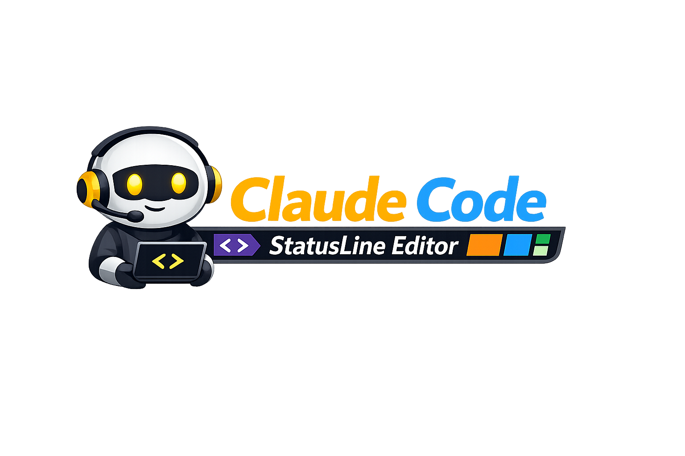
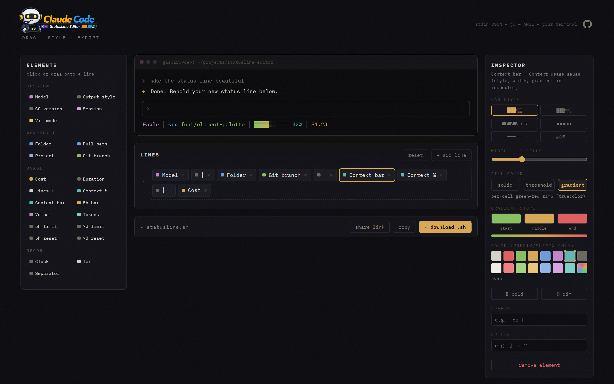

<p align="center">
  
</p>

Visual editor for the [Claude Code status line](https://code.claude.com/docs/en/statusline.md).
Drag elements onto a live terminal preview, style them, export a ready-to-use `statusline.sh`.

**Try it live: [azekyo.com/claude-code-status-line-editor](https://azekyo.com/claude-code-status-line-editor/)**



## Run

```sh
npm install
npm run dev
```

## How it works

Claude Code pipes a JSON payload (model, workspace, cost, context window, …) to the
configured `statusLine.command` on stdin; whatever the script prints becomes the status
line (ANSI colors supported, one printed line per row).

The editor keeps a document of rows × elements. Each element definition carries:

- a **preview** renderer fed by mock data (`src/mock.ts`)
- a **bash emitter** (`src/elements.ts`) producing jq-based setup lines

`src/exporter.ts` assembles those into a self-contained `statusline.sh` (requires `jq`).
Segments that may be empty at runtime (git branch, session name, vim mode) are guarded
so their prefix/suffix never print alone.

The script degrades gracefully across platforms: truecolor (gradients, custom colors)
is detected at runtime via `COLORTERM`/`WT_SESSION` and falls back to the nearest
16-color ANSI code elsewhere (e.g. macOS Terminal.app); jq is probed in common install
locations (override with `CLAUDE_STATUSLINE_JQ=/path`) with a readable message when
missing; CRLF from native Windows jq builds is stripped; a UTF-8 locale is selected
when the environment provides none.

## Install the exported script

1. Save as `~/.claude/statusline.sh`, `chmod +x` it
2. In `~/.claude/settings.json`:

```json
{
  "statusLine": {
    "type": "command",
    "command": "~/.claude/statusline.sh"
  }
}
```

## Dev notes

`scripts/gen-test.ts` generates a script covering every element type — run
`npx tsx scripts/gen-test.ts out.sh` and pipe any mock payload into `bash out.sh`.

`scripts/screenshot.mjs` regenerates the README screenshot (needs `npm run dev`
running and Playwright's Chromium: `npx playwright install chromium`).
